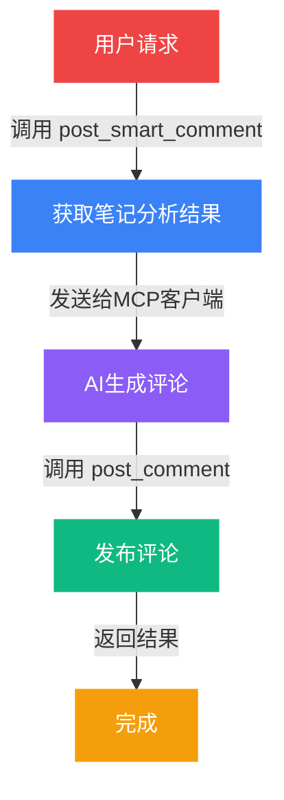

# <span class="text-red-400">小红书</span>自动搜索评论工具

## <span class="text-purple-400">MCP Server 2.0</span>

<div class="flex justify-center gap-6 mt-8">
  <div class="flex flex-col items-center">
    <div class="w-16 h-16 rounded-full bg-red-500/20 flex items-center justify-center text-3xl animate-bounce">🤖</div>
    <span class="text-sm mt-2">自动化</span>
  </div>
  <div class="flex flex-col items-center">
    <div class="w-16 h-16 rounded-full bg-purple-500/20 flex items-center justify-center text-3xl animate-pulse">🧠</div>
    <span class="text-sm mt-2">AI能力</span>
  </div>
  <div class="flex flex-col items-center">
    <div class="w-16 h-16 rounded-full bg-green-500/20 flex items-center justify-center text-3xl animate-bounce" style="animation-delay: 0.2s">💬</div>
    <span class="text-sm mt-2">智能评论</span>
  </div>
  <div class="flex flex-col items-center">
    <div class="w-16 h-16 rounded-full bg-blue-500/20 flex items-center justify-center text-3xl animate-pulse" style="animation-delay: 0.3s">🔐</div>
    <span class="text-sm mt-2">持久登录</span>
  </div>
</div>

---

# <span class="text-gradient bg-gradient-to-r from-red-400 to-pink-500">项目简介</span>

<div class="mt-8 p-6 rounded-xl bg-gradient-to-r from-red-900/30 to-purple-900/30 border border-red-500/30">
  <p class="text-lg leading-relaxed text-gray-200">
    这是一款基于 <span class="text-green-400">Playwright</span> 开发的小红书自动搜索和评论工具，作为 
    <span class="text-blue-400">MCP Server</span>，可通过特定配置接入 MCP Client（如 Claude for Desktop），
    帮助用户自动完成登录小红书、搜索关键词、获取笔记内容及发布 AI 生成评论等操作。
  </p>
</div>

---

# <span class="text-gradient bg-gradient-to-r from-orange-400 to-red-500">主要特点</span>

<div class="grid grid-cols-2 gap-4 mt-6">
  <div 
    v-click 
    class="p-5 rounded-xl bg-gradient-to-br from-red-900/50 to-red-800/30 border border-red-500/30 
           transform transition-all duration-500 hover:scale-105 hover:shadow-lg hover:shadow-red-500/20"
  >
    <div class="flex items-center gap-3 mb-3">
      <span class="text-3xl">🤖</span>
      <h3 class="text-xl text-red-400 font-bold">深度集成 AI 能力</h3>
    </div>
    <p class="text-gray-300 text-sm">利用 MCP 客户端的大模型能力，生成更自然、更相关的评论内容</p>
  </div>

  <div 
    v-click 
    class="p-5 rounded-xl bg-gradient-to-br from-orange-900/50 to-orange-800/30 border border-orange-500/30 
           transform transition-all duration-500 hover:scale-105 hover:shadow-lg hover:shadow-orange-500/20"
  >
    <div class="flex items-center gap-3 mb-3">
      <span class="text-3xl">🔧</span>
      <h3 class="text-xl text-orange-400 font-bold">模块化设计</h3>
    </div>
    <p class="text-gray-300 text-sm">将功能分为笔记分析、评论生成和评论发布三个独立模块</p>
  </div>
</div>

---

# <span class="text-gradient bg-gradient-to-r from-yellow-400 to-orange-500">更多优势</span>

<div class="grid grid-cols-2 gap-4 mt-6">
  <div 
    v-click 
    class="p-5 rounded-xl bg-gradient-to-br from-yellow-900/50 to-yellow-800/30 border border-yellow-500/30 
           transform transition-all duration-500 hover:scale-105"
  >
    <div class="flex items-center gap-3 mb-3">
      <span class="text-3xl">📝</span>
      <h3 class="text-xl text-yellow-400 font-bold">强大的内容获取</h3>
    </div>
    <p class="text-gray-300 text-sm">集成多种获取笔记内容的方法，确保完整获取</p>
  </div>

  <div 
    v-click 
    class="p-5 rounded-xl bg-gradient-to-br from-green-900/50 to-green-800/30 border border-green-500/30 
           transform transition-all duration-500 hover:scale-105"
  >
    <div class="flex items-center gap-3 mb-3">
      <span class="text-3xl">🔐</span>
      <h3 class="text-xl text-green-400 font-bold">持久化登录</h3>
    </div>
    <p class="text-gray-300 text-sm">使用持久化浏览器上下文，首次登录后无需重复登录</p>
  </div>
</div>

---

# <span class="text-gradient bg-gradient-to-r from-pink-400 to-purple-500">2.0 版本主要优化</span>

<div class="grid grid-cols-2 gap-6 mt-8">
  <div 
    class="relative overflow-hidden rounded-2xl bg-gradient-to-br from-pink-900/40 to-purple-900/40 
           border border-pink-500/30 p-6 group"
  >
    <div class="absolute inset-0 bg-gradient-to-r from-pink-500/10 to-transparent opacity-0 group-hover:opacity-100 transition-opacity"></div>
    <div class="relative">
      <div class="text-5xl mb-4">📄</div>
      <h3 class="text-2xl text-pink-400 font-bold mb-2">内容获取增强</h3>
      <p class="text-gray-300">重构笔记内容获取模块，增加页面加载等待时间和滚动操作</p>
    </div>
  </div>

  <div 
    class="relative overflow-hidden rounded-2xl bg-gradient-to-br from-purple-900/40 to-indigo-900/40 
           border border-purple-500/30 p-6 group"
  >
    <div class="absolute inset-0 bg-gradient-to-r from-purple-500/10 to-transparent opacity-0 group-hover:opacity-100 transition-opacity"></div>
    <div class="relative">
      <div class="text-5xl mb-4">🧠</div>
      <h3 class="text-2xl text-purple-400 font-bold mb-2">AI 评论生成</h3>
      <p class="text-gray-300">重构评论功能，由 MCP 客户端 AI 生成更自然的评论</p>
    </div>
  </div>
</div>

---

# <span class="text-gradient bg-gradient-to-r from-blue-400 to-cyan-500">核心功能模块</span>

<div class="space-y-4 mt-6">
  <div 
    v-click 
    class="p-4 rounded-xl bg-gradient-to-r from-blue-900/40 to-blue-800/20 border-l-4 border-blue-500 
           transform transition-all duration-300 hover:translate-x-2"
  >
    <div class="flex items-center gap-4">
      <div class="w-12 h-12 rounded-full bg-blue-500/20 flex items-center justify-center">
        <span class="text-blue-400 font-bold text-xl">1️⃣</span>
      </div>
      <div>
        <h3 class="text-lg text-blue-400 font-bold">用户认证与登录</h3>
        <p class="text-gray-400 text-sm">持久化登录，支持手动扫码，首次登录后保存状态</p>
      </div>
    </div>
  </div>

  <div 
    v-click 
    class="p-4 rounded-xl bg-gradient-to-r from-cyan-900/40 to-cyan-800/20 border-l-4 border-cyan-500 
           transform transition-all duration-300 hover:translate-x-2"
  >
    <div class="flex items-center gap-4">
      <div class="w-12 h-12 rounded-full bg-cyan-500/20 flex items-center justify-center">
        <span class="text-cyan-400 font-bold text-xl">2️⃣</span>
      </div>
      <div>
        <h3 class="text-lg text-cyan-400 font-bold">内容发现与获取</h3>
        <p class="text-gray-400 text-sm">智能关键词搜索，多维度内容获取，评论数据获取</p>
      </div>
    </div>
  </div>

  <div 
    v-click 
    class="p-4 rounded-xl bg-gradient-to-r from-green-900/40 to-green-800/20 border-l-4 border-green-500 
           transform transition-all duration-300 hover:translate-x-2"
  >
    <div class="flex items-center gap-4">
      <div class="w-12 h-12 rounded-full bg-green-500/20 flex items-center justify-center">
        <span class="text-green-400 font-bold text-xl">3️⃣</span>
      </div>
      <div>
        <h3 class="text-lg text-green-400 font-bold">内容分析与生成</h3>
        <p class="text-gray-400 text-sm">自动分析笔记内容，基于 AI 生成自然、相关的评论</p>
      </div>
    </div>
  </div>

  <div 
    v-click 
    class="p-4 rounded-xl bg-gradient-to-r from-yellow-900/40 to-yellow-800/20 border-l-4 border-yellow-500 
           transform transition-all duration-300 hover:translate-x-2"
  >
    <div class="flex items-center gap-4">
      <div class="w-12 h-12 rounded-full bg-yellow-500/20 flex items-center justify-center">
        <span class="text-yellow-400 font-bold text-xl">4️⃣</span>
      </div>
      <div>
        <h3 class="text-lg text-yellow-400 font-bold">数据返回与反馈</h3>
        <p class="text-gray-400 text-sm">结构化数据返回，提供评论发布结果的实时反馈</p>
      </div>
    </div>
  </div>
</div>

---

# <span class="text-gradient bg-gradient-to-r from-red-400 to-orange-500">四种评论类型</span>

<div class="grid grid-cols-2 gap-4 mt-6">
  <div class="p-4 rounded-xl bg-gray-800/50 border border-red-500/20 hover:border-red-500/50 transition-colors">
    <div class="flex items-center gap-2 mb-2">
      <span class="text-2xl">🎯</span>
      <h3 class="text-red-400 font-bold">引流型</h3>
    </div>
    <p class="text-gray-400 text-sm">引导用户关注或私聊</p>
  </div>

  <div class="p-4 rounded-xl bg-gray-800/50 border border-pink-500/20 hover:border-pink-500/50 transition-colors">
    <div class="flex items-center gap-2 mb-2">
      <span class="text-2xl">❤️</span>
      <h3 class="text-pink-400 font-bold">点赞型</h3>
    </div>
    <p class="text-gray-400 text-sm">简单互动获取好感</p>
  </div>

  <div class="p-4 rounded-xl bg-gray-800/50 border border-blue-500/20 hover:border-blue-500/50 transition-colors">
    <div class="flex items-center gap-2 mb-2">
      <span class="text-2xl">❓</span>
      <h3 class="text-blue-400 font-bold">咨询型</h3>
    </div>
    <p class="text-gray-400 text-sm">以问题形式增加互动</p>
  </div>

  <div class="p-4 rounded-xl bg-gray-800/50 border border-green-500/20 hover:border-green-500/50 transition-colors">
    <div class="flex items-center gap-2 mb-2">
      <span class="text-2xl">🎓</span>
      <h3 class="text-green-400 font-bold">专业型</h3>
    </div>
    <p class="text-gray-400 text-sm">展示专业知识建立权威</p>
  </div>
</div>

---

# <span class="text-gradient bg-gradient-to-r from-green-400 to-cyan-500">安装步骤</span>

<div class="text-left max-w-3xl mx-auto">
  <div class="mb-6">
    <h3 class="text-lg text-green-400 mb-2">📋 前置要求</h3>
    <p class="text-gray-300">Python 3.8 或更高版本</p>
  </div>

  <div class="mb-6">
    <h3 class="text-lg text-blue-400 mb-2">🧪 创建虚拟环境</h3>
    <div class="bg-gray-800/50 rounded-xl p-4 border border-gray-700">
```bash
# Windows
python -m venv venv
venv\Scripts\activate

# macOS/Linux
python3 -m venv venv
source venv/bin/activate
```
    </div>
  </div>
</div>

---

# <span class="text-gradient bg-gradient-to-r from-yellow-400 to-green-500">安装依赖</span>

<div class="text-left max-w-3xl mx-auto">
  <div class="bg-gradient-to-r from-yellow-900/30 to-green-900/30 rounded-xl p-6 border border-yellow-500/30">
```bash
# 安装项目依赖
pip install -r requirements.txt
pip install fastmcp

# 安装 Playwright 浏览器
playwright install
```
  </div>
</div>

---

# <span class="text-gradient bg-gradient-to-r from-purple-400 to-pink-500">MCP Server 配置</span>

<div class="text-left max-w-3xl mx-auto">
  <div class="bg-gradient-to-r from-purple-900/30 to-pink-900/30 rounded-xl p-6 border border-purple-500/30">
```json {lines:true}
{
  "mcpServers": {
    "xiaohongshu MCP": {
      "command": "C:\\Users\\username\\...\\venv\\Scripts\\python.exe",
      "args": [
        "C:\\Users\\username\\...\\xiaohongshu_mcp.py",
        "--stdio"
      ]
    }
  }
}
```
  </div>
</div>

---

# <span class="text-gradient bg-gradient-to-r from-blue-400 to-purple-500">主要功能操作</span>

<div class="grid grid-cols-2 gap-4 mt-6">
  <div 
    v-click 
    class="p-4 rounded-xl bg-gray-800/50 border border-blue-500/20 
           transform transition-all duration-300 hover:scale-102"
  >
    <h3 class="text-blue-400 font-bold mb-2">🔑 登录小红书</h3>
    <div class="bg-gray-900/50 rounded-lg p-3">
      <code class="text-gray-300 text-sm">帮我登录小红书账号</code>
    </div>
  </div>

  <div 
    v-click 
    class="p-4 rounded-xl bg-gray-800/50 border border-green-500/20 
           transform transition-all duration-300 hover:scale-102"
  >
    <h3 class="text-green-400 font-bold mb-2">🔍 搜索笔记</h3>
    <div class="bg-gray-900/50 rounded-lg p-3">
      <code class="text-gray-300 text-sm">帮我搜索小红书笔记，关键词为：美食</code>
    </div>
  </div>

  <div 
    v-click 
    class="p-4 rounded-xl bg-gray-800/50 border border-yellow-500/20 
           transform transition-all duration-300 hover:scale-102"
  >
    <h3 class="text-yellow-400 font-bold mb-2">📖 获取笔记内容</h3>
    <div class="bg-gray-900/50 rounded-lg p-3">
      <code class="text-gray-300 text-sm">帮我获取这个笔记的内容：https://xxx</code>
    </div>
  </div>

  <div 
    v-click 
    class="p-4 rounded-xl bg-gray-800/50 border border-pink-500/20 
           transform transition-all duration-300 hover:scale-102"
  >
    <h3 class="text-pink-400 font-bold mb-2">💬 发布智能评论</h3>
    <div class="bg-gray-900/50 rounded-lg p-3">
      <code class="text-gray-300 text-sm">帮我为这个笔记写一条专业评论：https://xxx</code>
    </div>
  </div>
</div>

---

# <span class="text-gradient bg-gradient-to-r from-cyan-400 to-blue-500">工作原理</span>

两步式评论流程：



---

# <span class="text-gradient bg-gradient-to-r from-indigo-400 to-purple-500">模块化设计</span>

<div class="grid grid-cols-3 gap-4 mt-8">
  <div class="relative group">
    <div class="p-5 rounded-xl bg-gradient-to-br from-blue-900/50 to-blue-800/30 border border-blue-500/30 
                transform transition-all duration-300 group-hover:scale-105 group-hover:shadow-lg group-hover:shadow-blue-500/20">
      <div class="text-4xl mb-3 text-center">📊</div>
      <h3 class="text-blue-400 font-bold text-center mb-2">笔记分析模块</h3>
      <p class="text-center text-gray-400 text-sm">analyze_note</p>
      <p class="text-center text-gray-500 text-xs mt-2">获取笔记信息，分析领域和关键词</p>
    </div>
  </div>

  <div class="relative group">
    <div class="p-5 rounded-xl bg-gradient-to-br from-purple-900/50 to-purple-800/30 border border-purple-500/30 
                transform transition-all duration-300 group-hover:scale-105 group-hover:shadow-lg group-hover:shadow-purple-500/20">
      <div class="text-4xl mb-3 text-center">🧠</div>
      <h3 class="text-purple-400 font-bold text-center mb-2">评论生成模块</h3>
      <p class="text-center text-gray-400 text-sm">MCP客户端</p>
      <p class="text-center text-gray-500 text-xs mt-2">基于笔记内容生成自然评论</p>
    </div>
  </div>

  <div class="relative group">
    <div class="p-5 rounded-xl bg-gradient-to-br from-green-900/50 to-green-800/30 border border-green-500/30 
                transform transition-all duration-300 group-hover:scale-105 group-hover:shadow-lg group-hover:shadow-green-500/20">
      <div class="text-4xl mb-3 text-center">📤</div>
      <h3 class="text-green-400 font-bold text-center mb-2">评论发布模块</h3>
      <p class="text-center text-gray-400 text-sm">post_comment</p>
      <p class="text-center text-gray-500 text-xs mt-2">定位评论框，发布评论</p>
    </div>
  </div>
</div>

---

# <span class="text-gradient bg-gradient-to-r from-orange-400 to-red-500">使用注意事项</span>

<div class="space-y-3 mt-6">
  <div 
    v-click 
    class="p-4 rounded-xl bg-gradient-to-r from-red-900/40 to-red-800/20 border-l-4 border-red-500"
  >
    <div class="flex items-center gap-3">
      <span class="text-2xl">⚠️</span>
      <div>
        <h4 class="text-red-400 font-bold">浏览器模式</h4>
        <p class="text-gray-400 text-sm">工具使用 Playwright 的非隐藏模式运行</p>
      </div>
    </div>
  </div>

  <div 
    v-click 
    class="p-4 rounded-xl bg-gradient-to-r from-orange-900/40 to-orange-800/20 border-l-4 border-orange-500"
  >
    <div class="flex items-center gap-3">
      <span class="text-2xl">⚠️</span>
      <div>
        <h4 class="text-orange-400 font-bold">登录方式</h4>
        <p class="text-gray-400 text-sm">首次登录需要手动扫码</p>
      </div>
    </div>
  </div>

  <div 
    v-click 
    class="p-4 rounded-xl bg-gradient-to-r from-yellow-900/40 to-yellow-800/20 border-l-4 border-yellow-500"
  >
    <div class="flex items-center gap-3">
      <span class="text-2xl">⚠️</span>
      <div>
        <h4 class="text-yellow-400 font-bold">平台规则</h4>
        <p class="text-gray-400 text-sm">请严格遵守小红书平台的相关规定</p>
      </div>
    </div>
  </div>

  <div 
    v-click 
    class="p-4 rounded-xl bg-gradient-to-r from-green-900/40 to-green-800/20 border-l-4 border-green-500"
  >
    <div class="flex items-center gap-3">
      <span class="text-2xl">⚠️</span>
      <div>
        <h4 class="text-green-400 font-bold">评论频率</h4>
        <p class="text-gray-400 text-sm">建议控制评论发布频率，每天不超过30条</p>
      </div>
    </div>
  </div>
</div>

---

# <span class="text-gradient bg-gradient-to-r from-pink-400 to-red-500">项目优势总结</span>

<div class="mt-8">
  <p class="text-lg text-gray-300 mb-6">
    小红书自动搜索评论工具 2.0 是一款功能强大的自动化工具。
  </p>

  <div class="grid grid-cols-2 gap-4">
    <div 
      v-click 
      class="p-4 rounded-xl bg-gradient-to-r from-red-900/40 to-red-800/20 border-l-4 border-red-500 
             transform transition-all duration-300 hover:scale-102"
    >
      <div class="flex items-center gap-2">
        <span class="text-xl">✅</span>
        <span class="text-red-400">深度集成 AI 能力，生成自然相关的评论</span>
      </div>
    </div>

    <div 
      v-click 
      class="p-4 rounded-xl bg-gradient-to-r from-orange-900/40 to-orange-800/20 border-l-4 border-orange-500 
             transform transition-all duration-300 hover:scale-102"
    >
      <div class="flex items-center gap-2">
        <span class="text-xl">✅</span>
        <span class="text-orange-400">模块化设计，提高代码可维护性</span>
      </div>
    </div>

    <div 
      v-click 
      class="p-4 rounded-xl bg-gradient-to-r from-yellow-900/40 to-yellow-800/20 border-l-4 border-yellow-500 
             transform transition-all duration-300 hover:scale-102"
    >
      <div class="flex items-center gap-2">
        <span class="text-xl">✅</span>
        <span class="text-yellow-400">持久化登录，无需重复扫码</span>
      </div>
    </div>

    <div 
      v-click 
      class="p-4 rounded-xl bg-gradient-to-r from-green-900/40 to-green-800/20 border-l-4 border-green-500 
             transform transition-all duration-300 hover:scale-102"
    >
      <div class="flex items-center gap-2">
        <span class="text-xl">✅</span>
        <span class="text-green-400">多种获取方法，确保内容完整获取</span>
      </div>
    </div>
  </div>
</div>

---
layout: center
class: text-center
---

# <span class="text-gradient bg-gradient-to-r from-red-400 via-pink-500 to-purple-500">开始使用</span>

<div class="mt-8">
  <div class="inline-block p-6 rounded-2xl bg-gradient-to-r from-red-900/30 to-purple-900/30 border border-red-500/30">
    <p class="text-xl text-gray-200">按照文档安装配置，开启您的小红书自动化之旅！</p>
  </div>
</div>

<div class="mt-8 flex justify-center gap-4">
  <div class="w-12 h-12 rounded-full bg-red-500/20 flex items-center justify-center text-2xl animate-bounce">🚀</div>
  <div class="w-12 h-12 rounded-full bg-pink-500/20 flex items-center justify-center text-2xl animate-bounce" style="animation-delay: 0.1s">🎯</div>
  <div class="w-12 h-12 rounded-full bg-purple-500/20 flex items-center justify-center text-2xl animate-bounce" style="animation-delay: 0.2s">✨</div>
</div>

---
layout: center
class: text-center
---

# <span class="text-gradient bg-gradient-to-r from-yellow-400 via-orange-500 to-red-500">谢谢观看！</span>

<div class="mt-8">
  <p class="text-xl text-gray-300">祝您使用愉快！</p>
  <div class="text-6xl mt-4">🎉</div>
</div>

<div class="absolute bottom-8 left-1/2 transform -translate-x-1/2 text-gray-500 text-sm">
  小红书自动搜索评论工具 MCP Server 2.0
</div>