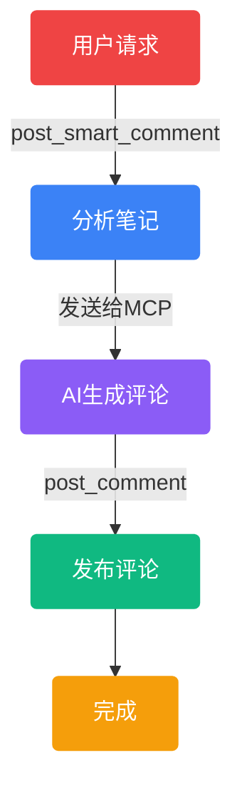

# <span class="bg-gradient-to-r from-red-400 via-pink-400 to-purple-400 bg-clip-text text-transparent text-4xl font-bold">小红书</span>自动搜索评论工具

## <span class="bg-gradient-to-r from-purple-400 via-blue-400 to-cyan-400 bg-clip-text text-transparent text-2xl">MCP Server 2.0</span>

<div class="relative z-10 flex justify-center gap-6 mt-8">
  <div 
    v-click
    class="flex flex-col items-center group"
  >
    <div class="w-14 h-14 rounded-xl bg-gradient-to-br from-red-500/30 to-red-600/20 flex items-center justify-center text-3xl transform transition-all duration-500 group-hover:scale-105 group-hover:rotate-6 shadow-md shadow-red-500/20">🤖</div>
    <span class="text-red-300 text-xs mt-2 font-medium">自动化</span>
  </div>
  <div 
    v-click
    class="flex flex-col items-center group"
  >
    <div class="w-14 h-14 rounded-xl bg-gradient-to-br from-purple-500/30 to-purple-600/20 flex items-center justify-center text-3xl transform transition-all duration-500 group-hover:scale-105 group-hover:-rotate-6 shadow-md shadow-purple-500/20">🧠</div>
    <span class="text-purple-300 text-xs mt-2 font-medium">AI能力</span>
  </div>
  <div 
    v-click
    class="flex flex-col items-center group"
  >
    <div class="w-14 h-14 rounded-xl bg-gradient-to-br from-green-500/30 to-green-600/20 flex items-center justify-center text-3xl transform transition-all duration-500 group-hover:scale-105 group-hover:rotate-6 shadow-md shadow-green-500/20">💬</div>
    <span class="text-green-300 text-xs mt-2 font-medium">智能评论</span>
  </div>
  <div 
    v-click
    class="flex flex-col items-center group"
  >
    <div class="w-14 h-14 rounded-xl bg-gradient-to-br from-blue-500/30 to-blue-600/20 flex items-center justify-center text-3xl transform transition-all duration-500 group-hover:scale-105 group-hover:-rotate-6 shadow-md shadow-blue-500/20">🔐</div>
    <span class="text-blue-300 text-xs mt-2 font-medium">持久登录</span>
  </div>
</div>

---

## <span class="bg-gradient-to-r bg-clip-text text-transparent from-red-400 to-pink-500 text-2xl">项目简介</span>

<div class="mt-4 p-3 rounded-lg bg-gradient-to-r from-red-900/30 to-purple-900/30 border border-red-500/30 max-w-3xl mx-auto">
  <p class="text-xs text-gray-400 text-center">
    基于 <span class="text-green-400">Playwright</span> 开发的小红书自动搜索评论工具，作为 
    <span class="text-blue-400">MCP Server</span> 接入 MCP Client，
    自动完成登录、搜索、获取内容及发布 AI 评论。
  </p>
</div>

---

## <span class="bg-gradient-to-r bg-clip-text text-transparent from-orange-400 to-red-500 text-2xl">主要特点</span>

<div class="grid grid-cols-2 gap-2 mt-3 max-w-3xl mx-auto">
  <div v-click class="p-2 rounded-lg bg-gradient-to-br from-red-900/50 to-red-800/30 border border-red-500/30">
    <div class="flex items-center gap-2">
      <span class="text-lg">🤖</span>
      <h3 class="text-xs text-red-400 font-bold">深度集成 AI</h3>
    </div>
    <p class="text-gray-500 text-xs mt-1">生成自然相关评论</p>
  </div>

  <div v-click class="p-2 rounded-lg bg-gradient-to-br from-orange-900/50 to-orange-800/30 border border-orange-500/30">
    <div class="flex items-center gap-2">
      <span class="text-lg">🔧</span>
      <h3 class="text-xs text-orange-400 font-bold">模块化设计</h3>
    </div>
    <p class="text-gray-500 text-xs mt-1">笔记分析、评论生成、发布</p>
  </div>
</div>

---

## <span class="bg-gradient-to-r bg-clip-text text-transparent from-yellow-400 to-orange-500 text-2xl">更多优势</span>

<div class="grid grid-cols-2 gap-2 mt-3 max-w-3xl mx-auto">
  <div v-click class="p-2 rounded-lg bg-gradient-to-br from-yellow-900/50 to-yellow-800/30 border border-yellow-500/30">
    <div class="flex items-center gap-2">
      <span class="text-lg">📝</span>
      <h3 class="text-xs text-yellow-400 font-bold">强大内容获取</h3>
    </div>
    <p class="text-gray-500 text-xs mt-1">多种方法确保完整获取</p>
  </div>

  <div v-click class="p-2 rounded-lg bg-gradient-to-br from-green-900/50 to-green-800/30 border border-green-500/30">
    <div class="flex items-center gap-2">
      <span class="text-lg">🔐</span>
      <h3 class="text-xs text-green-400 font-bold">持久化登录</h3>
    </div>
    <p class="text-gray-500 text-xs mt-1">首次登录后无需重复</p>
  </div>
</div>

---

## <span class="bg-gradient-to-r bg-clip-text text-transparent from-pink-400 to-purple-500 text-2xl">2.0 版本主要优化</span>

<div class="grid grid-cols-2 gap-3 mt-4 max-w-3xl mx-auto">
  <div class="p-3 rounded-lg bg-gradient-to-br from-pink-900/40 to-purple-900/40 border border-pink-500/30">
    <div class="text-xl mb-1">📄</div>
    <h3 class="text-xs text-pink-400 font-bold">内容获取增强</h3>
    <p class="text-gray-500 text-xs mt-1">增加页面加载等待和滚动操作</p>
  </div>

  <div class="p-3 rounded-lg bg-gradient-to-br from-purple-900/40 to-indigo-900/40 border border-purple-500/30">
    <div class="text-xl mb-1">🧠</div>
    <h3 class="text-xs text-purple-400 font-bold">AI 评论生成</h3>
    <p class="text-gray-500 text-xs mt-1">MCP客户端AI生成更自然评论</p>
  </div>
</div>

---

## <span class="bg-gradient-to-r bg-clip-text text-transparent from-blue-400 to-cyan-500 text-2xl">核心功能模块</span>

<div class="space-y-2 mt-3 max-w-4xl mx-auto">
  <div v-click class="p-2 rounded-lg bg-gradient-to-r from-blue-900/40 to-blue-800/20 border-l-2 border-blue-500">
    <div class="flex items-center gap-2">
      <div class="w-8 h-8 rounded-full bg-blue-500/20 flex items-center justify-center">
        <span class="text-blue-400 font-bold text-sm">1</span>
      </div>
      <div>
        <h3 class="text-xs text-blue-400 font-bold">用户认证与登录</h3>
        <p class="text-gray-500 text-xs">持久化登录，支持手动扫码</p>
      </div>
    </div>
  </div>

  <div v-click class="p-2 rounded-lg bg-gradient-to-r from-cyan-900/40 to-cyan-800/20 border-l-2 border-cyan-500">
    <div class="flex items-center gap-2">
      <div class="w-8 h-8 rounded-full bg-cyan-500/20 flex items-center justify-center">
        <span class="text-cyan-400 font-bold text-sm">2</span>
      </div>
      <div>
        <h3 class="text-xs text-cyan-400 font-bold">内容发现与获取</h3>
        <p class="text-gray-500 text-xs">智能关键词搜索，多维度内容获取</p>
      </div>
    </div>
  </div>

  <div v-click class="p-2 rounded-lg bg-gradient-to-r from-green-900/40 to-green-800/20 border-l-2 border-green-500">
    <div class="flex items-center gap-2">
      <div class="w-8 h-8 rounded-full bg-green-500/20 flex items-center justify-center">
        <span class="text-green-400 font-bold text-sm">3</span>
      </div>
      <div>
        <h3 class="text-xs text-green-400 font-bold">内容分析与生成</h3>
        <p class="text-gray-500 text-xs">基于 AI 生成自然相关评论</p>
      </div>
    </div>
  </div>

  <div v-click class="p-2 rounded-lg bg-gradient-to-r from-yellow-900/40 to-yellow-800/20 border-l-2 border-yellow-500">
    <div class="flex items-center gap-2">
      <div class="w-8 h-8 rounded-full bg-yellow-500/20 flex items-center justify-center">
        <span class="text-yellow-400 font-bold text-sm">4</span>
      </div>
      <div>
        <h3 class="text-xs text-yellow-400 font-bold">数据返回与反馈</h3>
        <p class="text-gray-500 text-xs">结构化数据返回，实时反馈</p>
      </div>
    </div>
  </div>
</div>

---

## <span class="bg-gradient-to-r bg-clip-text text-transparent from-red-400 to-orange-500 text-2xl">四种评论类型</span>

<div class="grid grid-cols-2 gap-2 mt-3">
  <div class="p-2 rounded-lg bg-gray-800/50 border border-red-500/20">
    <div class="flex items-center gap-1">
      <span class="text-sm">🎯</span>
      <h3 class="text-xs text-red-400 font-bold">引流型</h3>
    </div>
    <p class="text-gray-500 text-xs mt-1">引导用户关注或私聊</p>
  </div>

  <div class="p-2 rounded-lg bg-gray-800/50 border border-pink-500/20">
    <div class="flex items-center gap-1">
      <span class="text-sm">❤️</span>
      <h3 class="text-xs text-pink-400 font-bold">点赞型</h3>
    </div>
    <p class="text-gray-500 text-xs mt-1">简单互动获取好感</p>
  </div>

  <div class="p-2 rounded-lg bg-gray-800/50 border border-blue-500/20">
    <div class="flex items-center gap-1">
      <span class="text-sm">❓</span>
      <h3 class="text-xs text-blue-400 font-bold">咨询型</h3>
    </div>
    <p class="text-gray-500 text-xs mt-1">以问题形式增加互动</p>
  </div>

  <div class="p-2 rounded-lg bg-gray-800/50 border border-green-500/20">
    <div class="flex items-center gap-1">
      <span class="text-sm">🎓</span>
      <h3 class="text-xs text-green-400 font-bold">专业型</h3>
    </div>
    <p class="text-gray-500 text-xs mt-1">展示专业知识建立权威</p>
  </div>
</div>

---

## <span class="bg-gradient-to-r bg-clip-text text-transparent from-green-400 to-cyan-500 text-2xl">安装步骤</span>

<div class="text-left max-w-2xl mx-auto">
  <div class="mb-3">
    <h3 class="text-xs text-green-400 font-bold">📋 前置要求</h3>
    <p class="text-gray-500 text-xs">Python 3.8+</p>
  </div>

  <div>
    <h3 class="text-xs text-blue-400 font-bold">🧪 创建虚拟环境</h3>
    <div class="bg-gray-800/50 rounded-lg p-2 border border-gray-700 text-xs">
```bash
# Windows
python -m venv venv
venv\Scripts\activate

# macOS/Linux
python3 -m venv venv
source venv/bin/activate
```
    </div>
  </div>
</div>

---

## <span class="bg-gradient-to-r bg-clip-text text-transparent from-yellow-400 to-green-500 text-2xl">安装依赖</span>

<div class="text-left max-w-2xl mx-auto">
  <div class="bg-gradient-to-r from-yellow-900/30 to-green-900/30 rounded-lg p-3 border border-yellow-500/30">
```bash
pip install -r requirements.txt
pip install fastmcp
playwright install
```
  </div>
</div>

---

## <span class="bg-gradient-to-r bg-clip-text text-transparent from-purple-400 to-pink-500 text-2xl">MCP Server 配置</span>

<div class="text-left max-w-2xl mx-auto">
  <div class="bg-gradient-to-r from-purple-900/30 to-pink-900/30 rounded-lg p-3 border border-purple-500/30">
```json
{
  "mcpServers": {
    "xiaohongshu MCP": {
      "command": "path/to/python.exe",
      "args": ["path/to/xiaohongshu_mcp.py", "--stdio"]
    }
  }
}
```
  </div>
</div>

---

## <span class="bg-gradient-to-r bg-clip-text text-transparent from-blue-400 to-purple-500 text-2xl">主要功能操作</span>

<div class="grid grid-cols-2 gap-2 mt-3">
  <div v-click class="p-2 rounded-lg bg-gray-800/50 border border-blue-500/20">
    <h3 class="text-xs text-blue-400 font-bold">🔑 登录</h3>
    <div class="bg-gray-900/50 rounded p-2 mt-1">
      <code class="text-gray-400 text-xs">帮我登录小红书账号</code>
    </div>
  </div>

  <div v-click class="p-2 rounded-lg bg-gray-800/50 border border-green-500/20">
    <h3 class="text-xs text-green-400 font-bold">🔍 搜索</h3>
    <div class="bg-gray-900/50 rounded p-2 mt-1">
      <code class="text-gray-400 text-xs">搜索笔记，关键词：美食</code>
    </div>
  </div>

  <div v-click class="p-2 rounded-lg bg-gray-800/50 border border-yellow-500/20">
    <h3 class="text-xs text-yellow-400 font-bold">📖 获取内容</h3>
    <div class="bg-gray-900/50 rounded p-2 mt-1">
      <code class="text-gray-400 text-xs">获取笔记内容：https://xxx</code>
    </div>
  </div>

  <div v-click class="p-2 rounded-lg bg-gray-800/50 border border-pink-500/20">
    <h3 class="text-xs text-pink-400 font-bold">💬 发布评论</h3>
    <div class="bg-gray-900/50 rounded p-2 mt-1">
      <code class="text-gray-400 text-xs">写专业评论：https://xxx</code>
    </div>
  </div>
</div>

---

## <span class="bg-gradient-to-r bg-clip-text text-transparent from-cyan-400 to-blue-500 text-2xl">工作原理</span>

<div class="max-h-80 overflow-auto">

</div>

---

## <span class="bg-gradient-to-r bg-clip-text text-transparent from-indigo-400 to-purple-500 text-2xl">模块化设计</span>

<div class="grid grid-cols-3 gap-2 mt-3">
  <div class="p-2 rounded-lg bg-gradient-to-br from-blue-900/50 to-blue-800/30 border border-blue-500/30">
    <div class="text-sm text-center">📊</div>
    <h3 class="text-xs text-blue-400 font-bold text-center">笔记分析</h3>
    <p class="text-center text-gray-500 text-xs">analyze_note</p>
  </div>

  <div class="p-2 rounded-lg bg-gradient-to-br from-purple-900/50 to-purple-800/30 border border-purple-500/30">
    <div class="text-sm text-center">🧠</div>
    <h3 class="text-xs text-purple-400 font-bold text-center">评论生成</h3>
    <p class="text-center text-gray-500 text-xs">MCP客户端</p>
  </div>

  <div class="p-2 rounded-lg bg-gradient-to-br from-green-900/50 to-green-800/30 border border-green-500/30">
    <div class="text-sm text-center">📤</div>
    <h3 class="text-xs text-green-400 font-bold text-center">评论发布</h3>
    <p class="text-center text-gray-500 text-xs">post_comment</p>
  </div>
</div>

---

## <span class="bg-gradient-to-r bg-clip-text text-transparent from-orange-400 to-red-500 text-2xl">使用注意事项</span>

<div class="space-y-2 mt-3 max-w-3xl mx-auto">
  <div v-click class="p-2 rounded-lg bg-gradient-to-r from-red-900/40 to-red-800/20 border-l-2 border-red-500">
    <div class="flex items-center gap-2">
      <span class="text-sm">⚠️</span>
      <div>
        <h4 class="text-xs text-red-400 font-bold">浏览器模式</h4>
        <p class="text-gray-500 text-xs">使用 Playwright 非隐藏模式</p>
      </div>
    </div>
  </div>

  <div v-click class="p-2 rounded-lg bg-gradient-to-r from-orange-900/40 to-orange-800/20 border-l-2 border-orange-500">
    <div class="flex items-center gap-2">
      <span class="text-sm">⚠️</span>
      <div>
        <h4 class="text-xs text-orange-400 font-bold">登录方式</h4>
        <p class="text-gray-500 text-xs">首次登录需要手动扫码</p>
      </div>
    </div>
  </div>

  <div v-click class="p-2 rounded-lg bg-gradient-to-r from-yellow-900/40 to-yellow-800/20 border-l-2 border-yellow-500">
    <div class="flex items-center gap-2">
      <span class="text-sm">⚠️</span>
      <div>
        <h4 class="text-xs text-yellow-400 font-bold">平台规则</h4>
        <p class="text-gray-500 text-xs">遵守小红书平台规定</p>
      </div>
    </div>
  </div>

  <div v-click class="p-2 rounded-lg bg-gradient-to-r from-green-900/40 to-green-800/20 border-l-2 border-green-500">
    <div class="flex items-center gap-2">
      <span class="text-sm">⚠️</span>
      <div>
        <h4 class="text-xs text-green-400 font-bold">评论频率</h4>
        <p class="text-gray-500 text-xs">建议每天不超过30条</p>
      </div>
    </div>
  </div>
</div>

---

## <span class="bg-gradient-to-r from-pink-400 via-red-400 to-orange-400 bg-clip-text text-transparent text-2xl">项目优势总结</span>

<div class="relative z-10 max-w-2xl mx-auto">
  <p class="text-xs text-gray-500 text-center mb-3">小红书自动搜索评论工具 2.0</p>

  <div class="grid grid-cols-2 gap-2">
    <div v-click class="p-2 rounded-lg bg-gradient-to-br from-red-900/50 to-red-800/30 border border-red-500/30">
      <div class="flex items-center gap-2">
        <span class="text-xs">✅</span>
        <span class="text-xs text-red-400">集成AI能力，生成自然评论</span>
      </div>
    </div>

    <div v-click class="p-2 rounded-lg bg-gradient-to-br from-orange-900/50 to-orange-800/30 border border-orange-500/30">
      <div class="flex items-center gap-2">
        <span class="text-xs">✅</span>
        <span class="text-xs text-orange-400">模块化设计，提高可维护性</span>
      </div>
    </div>

    <div v-click class="p-2 rounded-lg bg-gradient-to-br from-yellow-900/50 to-yellow-800/30 border border-yellow-500/30">
      <div class="flex items-center gap-2">
        <span class="text-xs">✅</span>
        <span class="text-xs text-yellow-400">持久化登录，无需重复扫码</span>
      </div>
    </div>

    <div v-click class="p-2 rounded-lg bg-gradient-to-br from-green-900/50 to-green-800/30 border border-green-500/30">
      <div class="flex items-center gap-2">
        <span class="text-xs">✅</span>
        <span class="text-xs text-green-400">多种获取方法，确保内容完整</span>
      </div>
    </div>
  </div>
</div>

---
layout: center
class: text-center
---

## <span class="bg-gradient-to-r from-red-400 via-pink-400 to-purple-400 bg-clip-text text-transparent text-2xl">开始使用</span>

<div class="relative z-10">
  <div class="inline-block p-3 rounded-lg bg-gradient-to-br from-red-900/50 via-purple-900/40 to-pink-900/50 border border-red-500/30">
    <p class="text-xs text-gray-400">按照文档安装配置，开启您的小红书自动化之旅！</p>
  </div>

  <div class="mt-3 flex justify-center gap-3">
    <div>
      <div class="w-8 h-8 rounded-lg bg-gradient-to-br from-red-500/40 to-pink-500/40 flex items-center justify-center text-lg">🚀</div>
      <span class="text-red-400 text-xs mt-1 block">快速开始</span>
    </div>
    <div>
      <div class="w-8 h-8 rounded-lg bg-gradient-to-br from-pink-500/40 to-purple-500/40 flex items-center justify-center text-lg">🎯</div>
      <span class="text-pink-400 text-xs mt-1 block">精准定位</span>
    </div>
    <div>
      <div class="w-8 h-8 rounded-lg bg-gradient-to-br from-purple-500/40 to-indigo-500/40 flex items-center justify-center text-lg">✨</div>
      <span class="text-purple-400 text-xs mt-1 block">智能评论</span>
    </div>
  </div>
</div>

---
layout: center
class: text-center
---

## <span class="bg-gradient-to-r bg-clip-text text-transparent from-yellow-400 via-orange-500 to-red-500 text-3xl">谢谢观看！</span>

<div class="mt-4">
  <p class="text-sm text-gray-400">祝您使用愉快！</p>
  <div class="text-3xl mt-2">🎉</div>
</div>

<div class="absolute bottom-4 left-1/2 transform -translate-x-1/2 text-gray-600 text-xs">
  小红书自动搜索评论工具 MCP Server 2.0
</div>